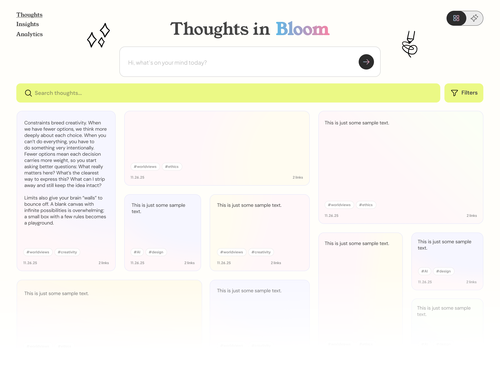

# Thoughts in Bloom

A living digital garden where ideas grow and connect over time.



## What We're Building

Ever jot down ideas throughout the day—from conversations, books, random shower thoughts—and then forget them? **Thoughts in Bloom** is a simple web app that helps you remember and see how your ideas connect.

Think of it like a Pinterest board for your brain. You drop thoughts in as cards, and they automatically organize themselves next to similar ideas. Over time, patterns emerge: you notice themes, see how certain people influence your thinking, and watch your ideas evolve into bigger perspectives.

**Why build this?** Most note apps just store things in folders or lists. But thoughts aren't linear—they're messy, connected, and always changing. This app treats your ideas like a garden: they bloom, branch out, and sometimes merge into something new. It's both beautiful (clean, airy design) and smart (spots connections you might miss).

No login required. No cloud storage. Just you, your browser, and your growing collection of thoughts.

---

## 🚀 How to Use

### Getting Started

1. **Open the app** in your web browser
2. **Type your thought** in the input field at the top
3. **Press the arrow button** (or use `Ctrl+Enter` / `Cmd+Enter`) to save

That's it! Your thought is now saved and displayed as a card.

### Adding Thoughts

- Enter your thought in the text area (up to 1,000 characters)
- The character counter shows how many characters you've used
- Click the **→** button or use keyboard shortcut to save
- New thoughts appear at the top of your garden

### Using Tags

Add hashtags to organize your thoughts:
- Type `#project` or `#meeting` directly in your thought text
- Tags are automatically extracted and displayed as blue badges
- Click any tag badge to filter thoughts by that tag
- Use the tag filter bar to quickly switch between tags

**Example thought:**
> Had a great conversation with #john about the #startup idea. Key insight: focus on user experience first.

### Editing Thoughts

1. Click the **Edit** button on any thought card
2. The thought appears in the input area for editing
3. Make your changes
4. Press **✓** to save or **Escape** to cancel
5. Edited thoughts show "(edited)" with a timestamp on hover

### Archiving vs. Deleting

Thoughts in Bloom uses **archiving** instead of permanent deletion:
- Click **Archive** to hide a thought from your main view
- Switch to **Archived** view to see all archived thoughts
- Click **Restore** to bring an archived thought back
- Your ideas are never truly lost!

### Searching

- Use the search bar to find thoughts containing specific words
- Matching text is highlighted in yellow
- Results count shows how many thoughts match
- Press **Escape** or click **×** to clear search

### View Modes

Toggle between two views using the buttons:
- **Active**: Your current, living thoughts
- **Archived**: Thoughts you've set aside

---

## ⌨️ Keyboard Shortcuts

| Action | Shortcut |
|--------|----------|
| Save thought | `Ctrl+Enter` (Windows/Linux) or `Cmd+Enter` (Mac) |
| Cancel edit mode | `Escape` |
| Clear search | `Escape` (when search is focused) |

---

## 🌐 Browser Compatibility

Thoughts in Bloom works in all modern browsers:

| Browser | Version | Status |
|---------|---------|--------|
| Chrome | 80+ | ✅ Fully supported |
| Firefox | 75+ | ✅ Fully supported |
| Safari | 13+ | ✅ Fully supported |
| Edge | 80+ | ✅ Fully supported |

**Requirements:**
- JavaScript must be enabled
- localStorage must be available (not in private/incognito mode on some browsers)
- Cookies don't need to be enabled

---

## 🔧 Troubleshooting

### My thoughts disappeared!

**Possible causes:**
1. **Different browser/device**: Data is stored locally in your browser. If you switch browsers or devices, you won't see your thoughts.
2. **Private/Incognito mode**: localStorage may not persist in private browsing.
3. **Cleared browser data**: Clearing site data removes saved thoughts.
4. **Storage quota exceeded**: If your browser's storage is full, new thoughts can't be saved.

**Solution:** Unfortunately, locally stored data cannot be recovered once deleted. Consider periodically backing up important thoughts elsewhere.

### The save button is disabled

**Check these things:**
1. Make sure you've typed something (empty thoughts can't be saved)
2. Character count must be under 1,000
3. If over the limit, the counter turns red—delete some text

### Thoughts aren't showing up

**Try these steps:**
1. Refresh the page
2. Check if you're in the correct view (Active vs. Archived)
3. Clear any active search or tag filters (click "All" in the tag bar)
4. Check browser console for errors (F12 → Console tab)

### Page looks broken or unstyled

**Possible fixes:**
1. Hard refresh: `Ctrl+Shift+R` (Windows/Linux) or `Cmd+Shift+R` (Mac)
2. Clear browser cache for this site
3. Ensure you're using a supported browser (see compatibility table above)

### Mobile keyboard covers the input

The app handles this automatically, but if issues persist:
1. Scroll up after tapping the input field
2. Try rotating your device to landscape mode
3. Use a different browser

---

## 📊 Data Storage

### How it works

- All data is stored in your browser's **localStorage**
- Data is saved as JSON under the key `thoughts`
- No data is sent to any server—everything stays on your device

### Data structure

Each thought is stored with:
```javascript
{
  id: "unique-uuid",           // Unique identifier
  text: "Your thought...",     // The thought content
  date: "2024-01-15T...",      // When it was created
  tags: ["#idea", "#work"],    // Extracted hashtags
  archived: false,             // Archive status
  updatedAt: "2024-01-16T..."  // Last edit time (if edited)
}
```

### Storage limits

- localStorage typically allows 5-10MB per domain
- Each thought uses roughly 200-500 bytes
- You can store thousands of thoughts before hitting limits

---

## 1. Core Concept & Purpose
- Build a living digital garden of thoughts—a space where ideas grow and connect over time
- Capture daily learnings from conversations, observations, and ideas I want to remember
- Form, expand, and refine my point of view as thoughts accumulate
- Watch thoughts influence and shape my perspective

## 2. Input & Capture
- Drop in a thought and watch it connect to other thoughts over time
- Save thoughts and instantly see them placed next to similar past ideas
- Log when each thought was written
- Tag thoughts with metadata (people, themes, days)

## 3. Visualization & Interface Modes
- **myMind Mode**: Clean cards with airy, dreamy, light aesthetic
- **Obsidian Mode**: Constellation view showing connections
- Toggle between both modes whenever I need to see connections
- Watch new thoughts slide into place with dynamic reorganization
- Click clusters to reveal underlying patterns or themes that tie ideas together

## 4. Connection & Intelligence
- Automatically surface insights, patterns, and connections across everything I've written
- See how thoughts connect over time
- Reveal patterns that tie ideas together
- Drag two thoughts together and merge them into an emerging point of view

## 5. Filtering & Navigation
- Filter my garden by people, themes, or days
- Tag a thought with a person's name and automatically see how that person has shaped my thinking
- Browse through different lenses of my thinking

## 6. Analytics & Insights
- Statistics on what is shaping my point of view the most
- Track sources: ideas, conversations, readings, observations, media, etc.
- Understand influence patterns across my garden

## 7. Technical Requirements
- Website/webapp format
- Combine the simplicity and visual style of myMind with the depth and linking power of Obsidian
- Dynamic, evolving layout system that reorganizes as my thinking evolves

## 8. Development Tooling & Workflow

### Design Process
- **Figma**: Design mockups before implementing new features
  - Create card layouts, color palettes, and interaction states
  - Export design tokens (colors, spacing, typography) for CSS implementation
  - Store design files in `/design` folder as exported PNGs for reference
  - Prototype complex features (constellation view, animations) before coding

### Development Environment
- **VSCode + GitHub Copilot**: Primary code editor
  - Use Live Server extension for instant preview during development
  - Leverage Copilot for CSS animations, localStorage patterns, and vanilla JS
  - Open HTML files directly in browser (no build process)

### Version Control & Deployment
- **GitHub**: Single source of truth for all code
  - Commit regularly as features are completed
  - Use descriptive commit messages tied to feature checklist
  - Main branch always represents the production-ready state

- **Vercel**: Automatic deployment platform
  - Connected to GitHub repository for continuous deployment
  - Every push to main triggers automatic deployment
  - Instant live URL accessible from any device
  - Preview deployments for testing before merging

### Workflow
1. **Design**: Create/update Figma mockups for new features
2. **Develop**: Build in VSCode with Copilot assistance
3. **Test**: Preview locally with Live Server
4. **Deploy**: Push to GitHub → Vercel auto-deploys
5. **Iterate**: Refine based on live usage

### Important Note on Data
Vercel hosts the application, but localStorage data remains device/browser-specific. Your thoughts are stored locally, not in the cloud.